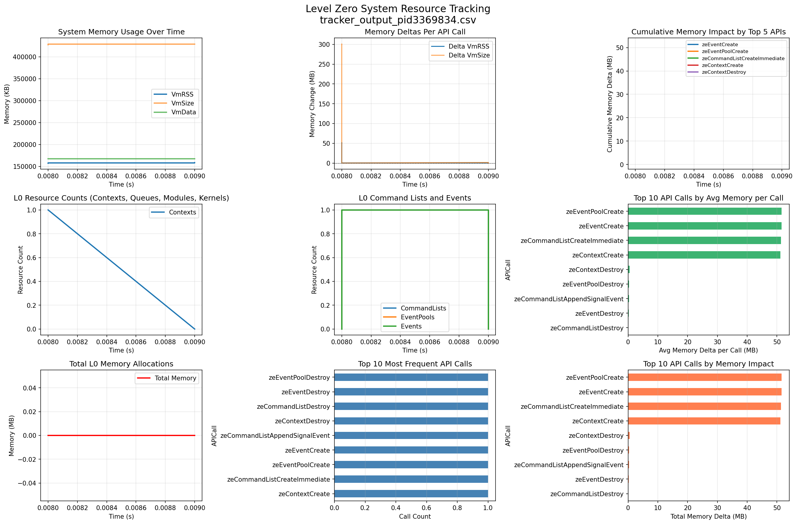

# System Resource Tracker Checker

## Overview

The System Resource Tracker is a Level Zero validation layer checker that monitors both Level Zero API resources and system resources in real-time. It tracks resource allocation and deallocation across all Level Zero API calls that create or destroy resources, providing detailed insights into memory usage, resource lifecycles, and system-level metrics.

**Platform Support:** Linux only. This checker uses `/proc/self/status` for system metrics and is not available on Windows or macOS.

## Features

- **Level Zero Resource Tracking**: Monitors all L0 resources including contexts, command queues, modules, kernels, event pools, command lists, events, fences, images, samplers, and memory allocations
- **Memory Leak Detection**: Automatically detects memory leaks by tracking handle-to-metrics mappings for all create/destroy operations:
  - Compares memory usage at resource creation vs destruction
  - Logs warnings when memory increases during destroy operations
  - Reports cumulative leaks per resource type at program exit
  - Provides detailed per-handle leak information
- **System Resource Monitoring**: Tracks real system metrics via `/proc/self/status` including:
  - Virtual memory size (VmSize)
  - Resident set size (VmRSS)
  - Data segment size (VmData)
  - Peak virtual memory (VmPeak)
  - Thread count
  - File descriptor count
- **Signed Delta Tracking**: Calculates both positive and negative resource changes (deltas) for each API call with proper signed arithmetic
- **Cumulative Summaries**: Maintains running totals of all resource types and leak totals
- **CSV Export**: Optionally exports timestamped data for graphing and analysis
- **Per-Process Isolation**: Each process creates a unique output file with PID appended
- **Thread-Safe**: Uses mutex protection for concurrent access using Meyers' singleton pattern
- **Low Overhead**: Minimal performance impact (< 1ms per API call)

## Usage

### Basic Tracking with Debug Logging

Enable the checker to log resource usage to the Level Zero debug log:

```bash
export ZE_ENABLE_VALIDATION_LAYER=1
export ZEL_ENABLE_SYSTEM_RESOURCE_TRACKER_CHECKER=1
export ZEL_ENABLE_LOADER_LOGGING=1
export ZEL_LOADER_LOGGING_LEVEL=debug

# Run your Level Zero application
./my_level_zero_app
```

### CSV Output for Graphing

Set the `ZEL_SYSTEM_RESOURCE_TRACKER_CSV` environment variable to specify the output CSV file path:

```bash
export ZE_ENABLE_VALIDATION_LAYER=1
export ZEL_ENABLE_SYSTEM_RESOURCE_TRACKER_CHECKER=1
export ZEL_SYSTEM_RESOURCE_TRACKER_CSV=tracker_output.csv

# Run your Level Zero application
./my_level_zero_app
```

**Note:** The actual output file will include the process ID (e.g., `tracker_output_pid12345.csv`) to ensure each process creates a unique file. This prevents conflicts when multiple processes use the tracker simultaneously.

## Tracked API Calls

The System Resource Tracker monitors the following Level Zero API functions:

### Context Management
- `zeContextCreate` - Creates L0 context, increments context count

### Command Queue Management
- `zeCommandQueueCreate` - Creates command queue, increments queue count
- `zeCommandQueueDestroy` - Destroys command queue, decrements queue count

### Module and Kernel Management
- `zeModuleCreate` - Creates module from binary, increments module count
- `zeModuleDestroy` - Destroys module, decrements module count
- `zeKernelCreate` - Creates kernel from module, increments kernel count
- `zeKernelDestroy` - Destroys kernel, decrements kernel count

### Event Management
- `zeEventPoolCreate` - Creates event pool, increments pool count
- `zeEventPoolDestroy` - Destroys event pool, decrements pool count
- `zeEventCreate` - Creates event, increments event count
- `zeEventDestroy` - Destroys event, decrements event count

### Command List Management
- `zeCommandListCreate` - Creates regular command list, increments list count
- `zeCommandListCreateImmediate` - Creates immediate command list, increments list count
- `zeCommandListDestroy` - Destroys command list, decrements list count
- `zeCommandListReset` - Resets command list state

### Synchronization
- `zeFenceCreate` - Creates fence, increments fence count
- `zeFenceDestroy` - Destroys fence, decrements fence count

### Image and Sampler Management
- `zeImageCreate` - Creates image, increments image count
- `zeImageDestroy` - Destroys image, decrements image count
- `zeSamplerCreate` - Creates sampler, increments sampler count
- `zeSamplerDestroy` - Destroys sampler, decrements sampler count

### Memory Management
- `zeMemAllocDevice` - Allocates device memory, tracks allocation size and count
- `zeMemAllocHost` - Allocates host memory, tracks allocation size and count
- `zeMemAllocShared` - Allocates shared memory, tracks allocation size and count
- `zeMemFree` - Frees memory, tracks deallocation

### Command List Append Operations
The tracker also monitors all command list append operations to measure memory deltas after each call:

**Memory Operations:**
- `zeCommandListAppendMemoryCopy` - Appends memory copy command
- `zeCommandListAppendMemoryFill` - Appends memory fill command
- `zeCommandListAppendMemoryCopyRegion` - Appends region-based memory copy
- `zeCommandListAppendMemoryCopyFromContext` - Appends cross-context memory copy
- `zeCommandListAppendMemoryPrefetch` - Appends memory prefetch hint
- `zeCommandListAppendMemAdvise` - Appends memory advice hint

**Image Operations:**
- `zeCommandListAppendImageCopy` - Appends image copy command
- `zeCommandListAppendImageCopyRegion` - Appends region-based image copy
- `zeCommandListAppendImageCopyToMemory` - Appends image-to-memory copy
- `zeCommandListAppendImageCopyFromMemory` - Appends memory-to-image copy

**Synchronization:**
- `zeCommandListAppendBarrier` - Appends barrier command
- `zeCommandListAppendMemoryRangesBarrier` - Appends memory ranges barrier
- `zeCommandListAppendSignalEvent` - Appends event signal command
- `zeCommandListAppendWaitOnEvents` - Appends wait on events command
- `zeCommandListAppendEventReset` - Appends event reset command

**Kernel Execution:**
- `zeCommandListAppendLaunchKernel` - Appends kernel launch command
- `zeCommandListAppendLaunchCooperativeKernel` - Appends cooperative kernel launch
- `zeCommandListAppendLaunchKernelIndirect` - Appends indirect kernel launch

**Query Operations:**
- `zeCommandListAppendQueryKernelTimestamps` - Appends kernel timestamp query
- `zeCommandListAppendWriteGlobalTimestamp` - Appends global timestamp write

## Output Format

### Debug Log Output

When logging is enabled, each tracked API call produces output like:

```
[debug] zeContextCreate: Context Count=1, handle=0x5567c00e2f98, Delta: VmRSS=+192KB, VmSize=+0KB, VmData=+0KB
[debug] 
  System Use After Call:
    Total System: VmRSS=158784KB, VmSize=427744KB, VmData=167456KB, Threads=2
    L0 Contexts (1): VmRSS=0KB, VmSize=0KB, VmData=0KB
```

When memory leaks are detected on destroy operations:

```
[warning] MEMORY LEAK DETECTED: Context handle=0x5567c00e2f98 - After destroy: VmRSS=+384KB, VmSize=+1796KB (Total Context leaks: 384KB)
```

At program exit, a comprehensive leak summary is logged:

```
[error] 
=== MEMORY LEAK SUMMARY ===
  Context leaks: 384 KB
  EventPool leaks: 384 KB
  CommandList leaks: 384 KB
  Event leaks: 192 KB
  TOTAL LEAKS: 1344 KB
===========================
```

### CSV Format

The CSV file contains the following columns:

| Column | Description |
|--------|-------------|
| `CallNumber` | Sequential call number |
| `TimeMs` | Elapsed time in milliseconds since tracker started |
| `APICall` | Level Zero API function name |
| `VmSize_KB` | Virtual memory size (KB) |
| `VmRSS_KB` | Resident set size (KB) |
| `VmData_KB` | Data segment size (KB) |
| `VmPeak_KB` | Peak virtual memory size (KB) |
| `Threads` | Number of threads |
| `Delta_VmSize_KB` | Signed change in VmSize since previous call (KB, can be negative) |
| `Delta_VmRSS_KB` | Signed change in VmRSS since previous call (KB, can be negative) |
| `Delta_VmData_KB` | Signed change in VmData since previous call (KB, can be negative) |
| `Contexts` | Current number of L0 contexts |
| `CommandQueues` | Current number of L0 command queues |
| `Modules` | Current number of L0 modules |
| `Kernels` | Current number of L0 kernels |
| `EventPools` | Current number of L0 event pools |
| `CommandLists` | Current number of L0 command lists |
| `Events` | Current number of L0 events |
| `Fences` | Current number of L0 fences |
| `Images` | Current number of L0 images |
| `Samplers` | Current number of L0 samplers |
| `TotalMemory_Bytes` | Total L0 memory allocated (bytes) |

**Note on Delta Values:** Delta columns use signed arithmetic to show both increases (positive) and decreases (negative) in memory usage. This enables accurate tracking of memory being freed or reduced.

## Visualization

### Using the Provided Python Script

A plotting script is provided to automatically generate visualizations:

```bash
# Install required Python packages
pip install pandas matplotlib

# Generate plots
python3 scripts/plot_resource_tracker.py tracker_output.csv
```

This will:
- Display interactive plots showing memory usage, resource counts, API call distribution, and **memory leak detection**
- Save plots to `tracker_output_plot.png`
- Print summary statistics including detected memory leaks

### Manual Analysis

You can also import the CSV into any data analysis tool:

**Python/Pandas:**
```python
import pandas as pd
df = pd.read_csv('tracker_output.csv')
print(df.describe())
```

**Excel/LibreOffice Calc:**
- Open the CSV file directly
- Create charts using the time series data

**R:**
```r
data <- read.csv('tracker_output.csv')
plot(data$TimeMs, data$VmRSS_KB, type='l')
```

## Example Visualizations

The plotting script generates 12 comprehensive visualizations:

1. **Memory Leak Detection Over Time** - Red cumulative leak line with scatter markers for individual leak events; light red background if leaks detected
2. **System Memory Usage Over Time** - VmRSS, VmSize, VmData trends
3. **Memory Leaks by API Call** - Horizontal bar chart showing total leaked memory per API type, or success message if no leaks
4. **Memory Deltas Per API Call** - Shows which calls increase/decrease memory in MB with signed deltas
5. **L0 Resource Counts** - Tracks contexts, queues, modules, kernels over time
6. **Command Lists and Events** - Monitors command list and event pool usage
7. **Total Memory Allocations** - Shows cumulative L0 memory allocations in MB
8. **Top 10 Most Frequent API Calls** - Bar chart sorted by call frequency
9. **Top 10 API Calls by Memory Impact** - Total memory delta in MB per API type
10. **Top 10 API Calls by Avg Memory per Call** - Average memory delta in MB per call
11. **Cumulative Memory Impact by Top 5 APIs** - Memory trends over time for highest-impact APIs
12. **Individual Leak Events Timeline** - Bar chart showing leak magnitude at each time point with total annotation

### Leak Detection Algorithm

The plotting script identifies potential memory leaks by:
1. Matching create/destroy API pairs (e.g., `zeContextCreate` ↔ `zeContextDestroy`)
2. Flagging destroy operations where memory **increased** by more than 100KB
3. Calculating cumulative leaked memory across the program's execution
4. Highlighting leak events with red visual indicators

**Example leak detection output:**
```
=== MEMORY LEAK DETECTION ===
⚠️  LEAKS DETECTED!
Total leaked memory: 0.19 MB (192.00 KB)
Number of leak events: 1

Leak events by API:
  zeEventPoolDestroy: 1 events, 0.19 MB total, 0.19 MB avg
```

### Example Plot



The example above shows a typical visualization with all 12 plots in a 4x3 grid displaying:
- **Row 1:** Memory leak detection, system memory trends, and leak summary by API
- **Row 2:** Memory deltas, resource counts, and command list/event tracking  
- **Row 3:** Total memory allocations, API call frequency, and memory impact rankings
- **Row 4:** Average memory per call, cumulative API impact, and individual leak events timeline

Command list append operations that have high memory deltas will automatically appear in the memory impact and cumulative trend plots. Memory leaks are prominently displayed with red highlighting and detailed annotations.

## Use Cases

- **Memory Leak Detection**: Automatically identify resources that aren't properly cleaned up
  - Detects leaks at both the validation layer level (real-time warnings) and plotting level (post-analysis)
  - Pinpoints exact handles and API calls that leaked memory
  - Quantifies leak severity with KB/MB measurements
- **Performance Analysis**: Identify excessive allocations and memory usage patterns
- **Resource Optimization**: Track resource lifecycle and identify unused resources
- **Debugging**: Correlate application behavior with resource usage patterns and leak events
- **Benchmarking**: Compare resource usage and leak counts across different runs or code versions
- **CI/CD Integration**: Automated tracking of resource usage and leak detection in test pipelines
- **Capacity Planning**: Understand peak resource requirements for production workloads
- **Regression Testing**: Detect unexpected increases in resource consumption or new memory leaks

## Implementation Details

### Architecture

The System Resource Tracker is implemented as a validation layer checker that uses both prologue and epilogue intercepts. When enabled, the validation layer injects calls to the tracker's functions before and after each tracked API call completes.

**Key Components:**
- `SystemResourceMetrics`: Structure holding system-level metrics (VmSize, VmRSS, etc.) with `signedDiff()` method for proper signed delta calculation
- `ResourceTracker`: Meyers' singleton pattern structure maintaining:
  - Cumulative resource counts and metrics
  - Handle-to-metrics maps for all 11 resource types (contexts, queues, modules, kernels, event pools, command lists, events, fences, images, samplers, memory allocations)
  - Per-resource-type leak counters
  - Thread-local pre-call metrics storage for append operations
- `getResourceTracker()`: Function-local static singleton accessor ensuring proper initialization order
- `getSystemResourceMetrics()`: Parses `/proc/self/status` to read current system metrics
- `checkForLeak()`: Compares creation metrics to destruction metrics and logs warnings if memory increased
- `writeCsvData()`: Atomic CSV line writer using ostringstream with signed delta support
- `logResourceSummary()`: Formats and logs cumulative resource usage
- Prologue/Epilogue function pairs: 44 functions (22 pairs) for create/destroy operations plus 28 functions (14 pairs) for append operations

### Thread Safety

The tracker uses multiple mechanisms to ensure thread safety:
- **Meyers' Singleton Pattern**: Function-local static `ResourceTracker` ensures initialization on first use, avoiding static initialization order fiasco
- **Mutex Protection**: All prologue and epilogue functions acquire the tracker's mutex before accessing shared state
- **Thread-Local Storage**: Pre-call metrics for append operations are stored per-thread to avoid conflicts
- **Atomic CSV Writes**: CSV lines are built using ostringstream and written atomically
- **Handle-to-Metrics Maps**: Each resource type has its own map protected by the shared mutex

### Performance Considerations

- Tracking overhead is approximately < 1ms per API call
- System metrics are read by parsing a small text file (`/proc/self/status` on Linux)
- CSV writes are buffered and flushed after each call to ensure crash safety
- The tracker only runs when explicitly enabled via environment variable

### Platform Support

The System Resource Tracker is **Linux-only** and relies on `/proc/self/status` for system resource metrics. The checker is automatically excluded from builds on Windows and macOS.

## Troubleshooting

### Empty CSV File (Header Only)

If the CSV file contains only the header row with no data, this was caused by a static initialization order bug that has been fixed. The current version uses a Meyers' singleton pattern (`getResourceTracker()`) to ensure proper initialization.

**Solution**: Rebuild with the latest version and regenerate the CSV file.

### CSV Parsing Errors

If you encounter `pandas.errors.ParserError` with messages like "Expected X fields, saw Y", this indicates corrupted CSV data. This can happen if:

1. The CSV file was generated by an older version with a data race bug (fixed in current version)
2. The application crashed during a write operation

**Solution**: Generate a new CSV file with the current version of the tracker, which uses:
- Atomic line writes to prevent data corruption
- Unique filenames per process (with PID appended) to prevent conflicts
- Meyers' singleton pattern for proper initialization

### False Positive Leak Detection

The plotting script uses a 100KB threshold for leak detection. Small memory increases during destroy operations may be normal due to:
- Internal driver caching
- Deferred cleanup in the driver
- Memory allocation granularity

If you see small leaks (< 100KB), they may not represent actual application leaks. The validation layer's real-time leak detection provides more accurate results as it compares metrics at the exact moment of creation vs destruction.

## Notes

- Each process creates a unique CSV file with the process ID appended (e.g., `tracker_pid12345.csv`)
- CSV output is flushed after each API call to ensure data is captured even if the application crashes
- The tracker uses atomic line writes to prevent data corruption in multi-threaded applications
- The tracker adds minimal overhead (< 1ms per API call)
- CSV files can grow large for long-running applications; consider log rotation for production use
- Both CSV output and debug logging can be enabled simultaneously
